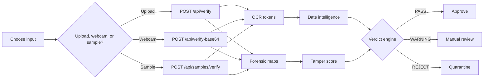
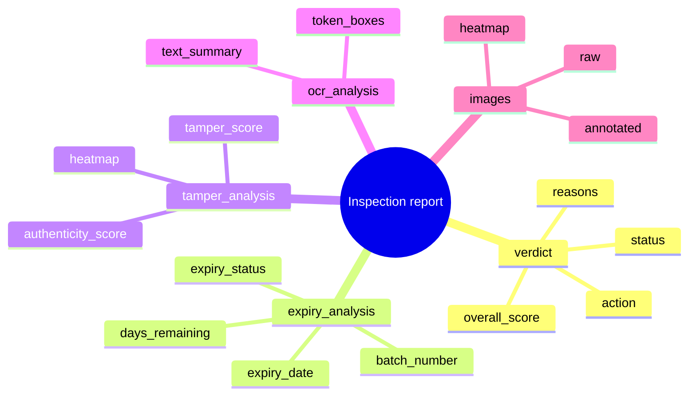
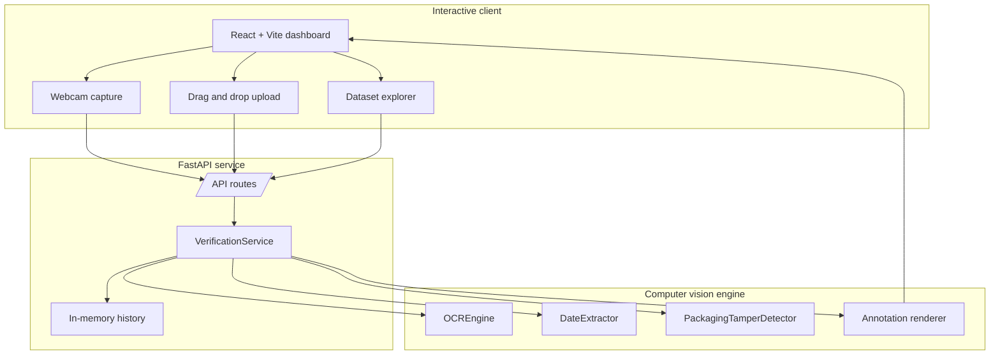
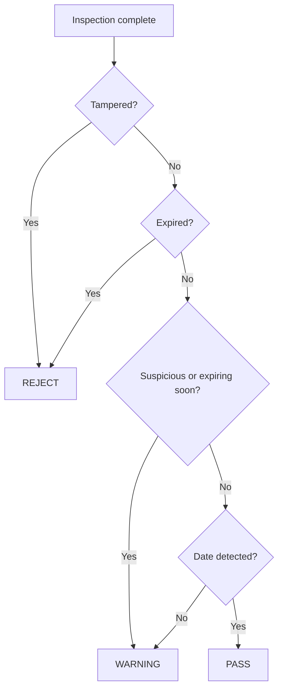
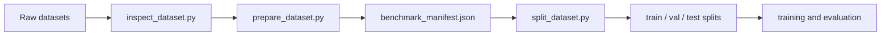

# VeriSight

AI packaging integrity and expiry verification for retail, food, and pharmaceutical products.

<p>
  <a href="#launch-pad"></a>
  <a href="#api-playground"></a>
  <a href="#inspection-report"></a>
  <a href="#architecture"></a>
  <a href="#benchmark-results"></a>
</p>

VeriSight turns a package photo into a decision-ready inspection: OCR finds expiry evidence, date logic checks shelf-life, forensic analysis searches for manipulation, and the dashboard renders annotated images, heatmaps, metrics, and exportable reports.

```text
Scan package -> Read dates -> Detect tampering -> Explain verdict -> Export audit
```

## Launch Pad

Choose the route that matches what you want to do right now.

| I want to... | Open this | Outcome |
|---|---|---|
| See it running fast | [Quick Start](#quick-start) | Local backend and React dashboard |
| Ship it in one command | [Docker](#docker) | Full app on `localhost:8000` |
| Test the engine directly | [API Playground](#api-playground) | Copyable API calls |
| Decode a verdict | [Inspection Report](#inspection-report) | What each result field means |
| Understand the internals | [Architecture](#architecture) | System flow, modules, and decision logic |
| Prepare benchmarks | [Datasets](#datasets) | Dataset manifests and splits |
| Review evidence | [Benchmark Results](#benchmark-results) | Accuracy, precision, recall, confusion matrix, and feature importance |

<details open>
<summary><strong>60-second demo path</strong></summary>

```bash
python -m backend.app
```

```bash
cd frontend
npm install
npm run dev
```

Then open `http://localhost:5173`, drop in a package image, switch between `annotated`, `heatmap`, and `raw`, and export the JSON report.

</details>

<details>
<summary><strong>What makes this different from plain OCR?</strong></summary>

VeriSight does not stop after reading text. It cross-checks extracted dates with shelf-life rules, inspects the image substrate for manipulation signals, and returns a verdict with reasons. That means a clear future expiry can still be rejected if the date region looks spliced, repainted, or digitally altered.

</details>

## Product Tour

<details open>
<summary><strong>Interactive inspection workflow</strong></summary>



</details>

<details>
<summary><strong>Dashboard controls</strong></summary>

| Control | What it does |
|---|---|
| Upload panel | Drag in a packaging image and run a full inspection |
| Camera mode | Capture a live frame and send it to `/api/verify-base64` |
| Sample browser | Pull curated benchmark samples into the scanner |
| View mode switcher | Compare annotated, heatmap, and raw image layers |
| History rail | Review recent verdicts and processing times |
| Export button | Download the full inspection JSON |

</details>

<details>
<summary><strong>Core AI signals</strong></summary>

- OCR extraction with Tesseract and adaptive OpenCV preprocessing.
- Date parsing for expiry, best-before, manufacturing, packing, batch, and lot markers.
- Shelf-life status classification: `VALID`, `EXPIRING_SOON`, `EXPIRED`, or `UNKNOWN`.
- Error Level Analysis for localized compression artifacts.
- Noise-floor and edge-discontinuity checks for spliced or altered package regions.
- Thermal forensic heatmap generation for visual review.

</details>

<details>
<summary><strong>Example verdict narrative</strong></summary>

```text
Inspection VS-A1B2C3D4
Status: WARNING
Why:
  - Expiry date is valid but close to the shelf-life threshold.
  - Packaging substrate has suspicious compression variance near the date stamp.
Action:
  - Hold for manual review before distribution.
Evidence:
  - Annotated OCR image
  - Thermal forensic heatmap
  - Extracted OCR tokens
```

</details>

## Quick Start

### Prerequisites

- Python 3.11+
- Node.js 20+
- Tesseract OCR installed on your machine
- Optional: Docker and Docker Compose

### Backend

<details open>
<summary><strong>Start the verification API</strong></summary>

```bash
python -m venv .venv
source .venv/bin/activate
pip install -r requirements.txt
python -m backend.app
```

The API starts at `http://localhost:8000`.

</details>

### Frontend

<details open>
<summary><strong>Start the dashboard</strong></summary>

```bash
cd frontend
npm install
npm run dev
```

The dashboard starts at `http://localhost:5173` and proxies API requests to the backend.

</details>

## Docker

<details open>
<summary><strong>Run the full app in a container</strong></summary>

```bash
docker compose up --build
```

The container serves both the FastAPI backend and the built React frontend at `http://localhost:8000`.

</details>

## API Playground

<details open>
<summary><strong>Health check</strong></summary>

```bash
curl http://localhost:8000/api/health
```

Expected shape:

```json
{
  "status": "ok",
  "service": "VeriSight Engine",
  "tesseract": true
}
```

</details>

<details>
<summary><strong>Verify an uploaded image</strong></summary>

```bash
curl -X POST http://localhost:8000/api/verify \
  -F "file=@/path/to/package.jpg" \
  -F "product_name=Sample Product"
```

</details>

<details>
<summary><strong>Send a webcam-style Base64 frame</strong></summary>

```bash
curl -X POST http://localhost:8000/api/verify-base64 \
  -H "Content-Type: application/json" \
  -d '{
    "image_base64": "data:image/jpeg;base64,...",
    "filename": "webcam_scan.jpg",
    "product_name": "Live Scan"
  }'
```

</details>

<details>
<summary><strong>Verify a benchmark sample</strong></summary>

```bash
curl http://localhost:8000/api/samples?limit=5
```

```bash
curl -X POST http://localhost:8000/api/samples/verify \
  -H "Content-Type: application/json" \
  -d '{"sample_id":"expdate_img_00001.jpg"}'
```

</details>

<details>
<summary><strong>Read inspection telemetry</strong></summary>

```bash
curl http://localhost:8000/api/history
curl http://localhost:8000/api/metrics
```

</details>

For the complete endpoint contract, see [docs/api.md](docs/api.md).

## Inspection Report

The API returns a single report object designed to be useful for a UI, an audit log, or a downstream rules engine.

<details open>
<summary><strong>Report anatomy</strong></summary>



</details>

<details>
<summary><strong>Status cards</strong></summary>

| Status | Meaning | Typical next move |
|---|---|---|
| `PASS` | Date evidence is valid and packaging appears authentic | Approve for consumption or distribution |
| `WARNING` | Date is unclear, close to expiry, or forensics are suspicious | Route to manual review |
| `REJECT` | Product is expired or tampering is detected | Quarantine and investigate |

</details>

<details>
<summary><strong>Minimal response shape</strong></summary>

```json
{
  "id": "VS-A1B2C3D4",
  "verdict": {
    "status": "PASS",
    "reasons": [
      "Authentic packaging substrate",
      "Fresh & Valid"
    ]
  },
  "expiry_analysis": {
    "expiry_status": "VALID",
    "expiry_date": "2027-05-20"
  },
  "tamper_analysis": {
    "status": "AUTHENTIC",
    "tamper_score": 0.058
  }
}
```

</details>

## Architecture



| Layer | Path | Responsibility |
|---|---|---|
| Frontend | `frontend/src/App.jsx` | Uploads, webcam capture, sample browser, visual review, report export |
| API | `backend/api/routes.py` | `/api/verify`, `/api/verify-base64`, `/api/samples`, `/api/history`, `/api/metrics` |
| Orchestration | `backend/services/verification_service.py` | Runs OCR, date extraction, tamper analysis, verdict synthesis |
| OCR/date AI | `backend/ml/ocr_engine.py`, `backend/ml/date_extractor.py` | Text extraction, token boxes, expiry and batch parsing |
| Forensics | `backend/ml/tamper_detector.py` | ELA, noise variance, edge checks, heatmap generation |
| Datasets | `datasets/processed`, `scripts/` | Benchmark manifest creation, splitting, and inspection |

## Verdict Logic

| Tamper status | Expiry status | Verdict | Action |
|---|---|---|---|
| `TAMPERED` | Any | `REJECT` | Quarantine product and review packaging integrity |
| `AUTHENTIC` | `EXPIRED` | `REJECT` | Do not consume or distribute |
| `SUSPICIOUS` | `VALID` | `WARNING` | Send for manual inspection |
| `AUTHENTIC` | `EXPIRING_SOON` | `WARNING` | Prioritize clearance |
| `AUTHENTIC` | `VALID` | `PASS` | Approve for distribution or consumption |

<details>
<summary><strong>Decision flow</strong></summary>



</details>

## Datasets

VeriSight is prepared for these benchmark sources:

| Dataset | Current processed samples | Purpose | Status |
|---|---:|---|---|
| ExpDate-Real | `1,102` | Real product packaging images with expiry/date annotations | Included in processed manifest |
| IMD2020 | `2,227` | Authentic and manipulated images for tamper/forgery detection | Included in processed manifest |
| OpenFoodFacts | `999` | Real commercial product packaging imagery | Included in processed manifest |
| FoodPackagingOCR | Not in current processed manifest | Packaging text detection and recognition | Documented and supported by catalog tooling |
| Total | `4,328` | Unified benchmark manifest | `datasets/processed/benchmark_manifest.json` |

Processed split sizes:

| Split | Samples | ExpDate-Real | IMD2020 | OpenFoodFacts |
|---|---:|---:|---:|---:|
| Train | `3,029` | `775` | `1,542` | `712` |
| Validation | `649` | `153` | `355` | `141` |
| Test | `650` | `174` | `330` | `146` |

```bash
python scripts/inspect_dataset.py
python scripts/prepare_dataset.py
python scripts/split_dataset.py
```

More detail lives in [docs/dataset.md](docs/dataset.md).

<details>
<summary><strong>Source dataset details</strong></summary>

| Dataset | Documented source detail |
|---|---|
| ExpDate-Real | `1,102` product packaging images, `1,244` date bounding boxes, and `895` due-marker annotations |
| IMD2020 | `414` manipulation folders with authentic originals, manipulated images, and binary masks |
| FoodPackagingOCR | Documented as `8,736` train, `1,092` validation, and `1,092` test annotations for packaging OCR tasks |
| OpenFoodFacts | Product packaging catalog/images for broader real-world packaging coverage |

Note: the repository currently contains processed manifests, but the raw dataset folders may need to be downloaded or mounted locally before rerunning inspection and preparation scripts.

</details>

<details>
<summary><strong>Dataset workflow</strong></summary>



</details>

## Benchmark Results

The current measured benchmark is for the tamper/forgery classifier saved in [reports/tamper_model_report.json](reports/tamper_model_report.json). OCR/date-extraction benchmark metrics are not yet saved in this repository, so those should be measured before making final production or patent-strength performance claims.

<details open>
<summary><strong>Tamper classifier performance</strong></summary>

| Metric | Result |
|---|---:|
| Model | `GradientBoostingClassifier` |
| Estimators | `200` |
| Max depth | `4` |
| Learning rate | `0.1` |
| Training samples | `2,900` |
| Validation samples | `726` |
| Training time | `1.67 sec` |
| Accuracy | `79.34%` |
| Precision | `78.25%` |
| Recall | `81.27%` |
| F1-score | `79.73%` |
| 5-fold CV F1 mean | `78.66%` |

Cross-validation F1 scores:

```text
0.7966, 0.7795, 0.7817, 0.7900, 0.7853
```

</details>

<details>
<summary><strong>Confusion matrix and error rates</strong></summary>

| Actual / Predicted | Authentic | Tampered |
|---|---:|---:|
| Authentic | `281` | `82` |
| Tampered | `68` | `295` |

Derived validation error values:

| Error measure | Result |
|---|---:|
| False positives | `82` |
| False positive rate | `22.59%` |
| False negatives | `68` |
| False negative rate | `18.73%` |
| Specificity | `77.41%` |

</details>

<details>
<summary><strong>Feature importance</strong></summary>

| Feature | Importance |
|---|---:|
| ELA x noise interaction | `0.1723` |
| Edge anomaly | `0.1505` |
| Red channel mean | `0.1318` |
| Red channel std | `0.0771` |
| Blue channel mean | `0.0762` |
| Blue channel std | `0.0631` |
| ELA peak | `0.0630` |
| Green channel std | `0.0621` |
| DCT artifact score | `0.0466` |
| ELA std | `0.0463` |
| JPEG block artifact | `0.0395` |
| ELA mean | `0.0218` |
| Noise score | `0.0093` |

</details>

<details>
<summary><strong>Current evidence status</strong></summary>

| Evidence item | Status |
|---|---|
| Tamper detection accuracy, precision, recall, F1 | Measured and saved in `reports/tamper_model_report.json` |
| False positives / false negatives | Derived from saved confusion matrix |
| OCR date extraction success rate | Not yet measured in a saved benchmark report |
| Full ablation study | Not yet measured as module-removal experiments |
| Dataset split counts | Measured from processed JSON files |
| Packaging-specific raw data coverage | Partially represented; more real low-light, curved, glossy, multilingual, and physically tampered samples are recommended |

</details>

## Novelty And IPR Evidence

VeriSight is designed as a combined expiry-verification and packaging-integrity inspection system. It does not only read printed dates; it correlates date evidence with forensic image signals and produces an explainable product-level verdict.

<details open>
<summary><strong>Novelty statement</strong></summary>

VeriSight proposes an integrated AI-based packaging verification system that combines expiry-date OCR, date-context interpretation, shelf-life classification, forensic image tamper analysis, anomaly heatmap generation, and an automated decision engine into a single inspection pipeline. Unlike conventional OCR systems that only extract printed text, VeriSight correlates extracted expiry/manufacturing information with visual forensic signals such as compression inconsistency, sensor-noise variance, edge discontinuity, JPEG artifact behavior, and localized tamper hotspots to determine whether a product should be approved, manually reviewed, or rejected.

</details>

<details>
<summary><strong>Potential system claims</strong></summary>

1. A computer-implemented system for verifying packaged goods using image-based expiry detection and packaging integrity analysis.
2. A method for extracting expiry, manufacturing, batch, and lot information from product packaging using OCR and contextual date parsing.
3. A method for generating a packaging tamper score using Error Level Analysis, noise-floor inconsistency, edge-gradient anomaly detection, JPEG artifact analysis, and machine-learning classification.
4. A method for generating a forensic heatmap that visually identifies suspected tampered regions on product packaging.
5. A decision engine that combines expiry status and tamper status to classify a product as `PASS`, `WARNING`, or `REJECT`.
6. A user interface that allows upload, live camera capture, benchmark sample inspection, visual layer switching, and exportable audit reports.

</details>

<details>
<summary><strong>Ablation status</strong></summary>

Feature-importance analysis indicates that the combined ELA-noise interaction, edge anomaly features, color-channel inconsistencies, and compression-derived features contribute to tamper classification. A full module-removal ablation study is still recommended to compare:

| Pipeline | Status |
|---|---|
| OCR/date extraction only | To be benchmarked |
| Classical forensics only: ELA + noise + edge | To be benchmarked |
| ML tamper classifier only | Partially benchmarked through saved classifier report |
| Combined OCR + forensics + decision engine | To be benchmarked end-to-end |

</details>

<details>
<summary><strong>Recommended additional data for stronger IPR filing</strong></summary>

- Real tampered expiry-label photographs.
- Low-light and motion-blurred retail shelf images.
- Curved bottles, cans, blister packs, foil packs, and glossy wrappers.
- Multilingual expiry formats and region-specific date formats.
- Reprinted, erased, overwritten, sticker-covered, and digitally edited date stamps.
- Negative examples where OCR fails or no expiry date is visible.

</details>

## Training And Evaluation

```bash
python scripts/train_tamper_model.py
pytest tests/test_pipeline.py -v
```

The repository includes serialized model artifacts in `models/` and a generated report at `reports/tamper_model_report.json`.

## Project Map

```text
verisight/
├── backend/                 FastAPI app, routes, services, ML modules
├── frontend/                React + Vite dashboard
├── datasets/processed/      Benchmark manifests and splits
├── docs/                    API, architecture, and dataset notes
├── models/                  Serialized tamper classifier artifacts
├── reports/                 Model and benchmark reports
├── scripts/                 Dataset preparation and training utilities
└── tests/                   Pipeline tests
```

## Docs

- [API reference](docs/api.md)
- [Architecture document](docs/architecture.md)
- [Dataset documentation](docs/dataset.md)

## Try Next

- Run a package image through the dashboard and compare `annotated` vs `heatmap`.
- Call `/api/metrics` after several scans to see pass, warning, and reject counts change.
- Add real files under the raw dataset folders, rebuild the manifest, and inspect new samples from the dashboard.
- Train or replace the tamper model artifacts in `models/`, then rerun the pipeline tests.

## Notes

- Tesseract availability is exposed by `/api/health`.
- The backend keeps recent inspection history in memory, so history resets when the process restarts.
- Docker builds the React app first, then serves the compiled frontend through the FastAPI runtime image.
